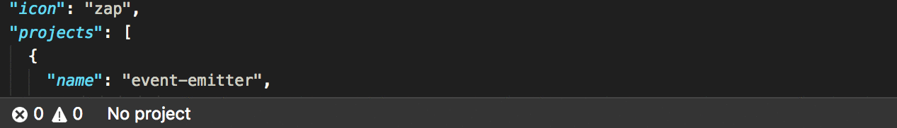
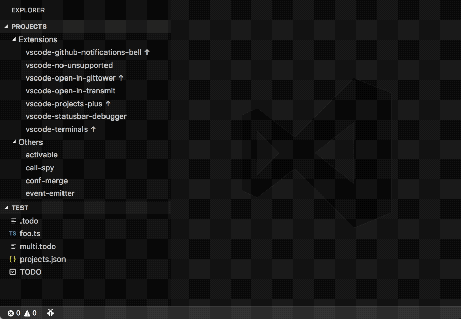

# Projects+

<p align="center">
  
</p>

An extension for managing projects. Feature rich, customizable, automatically finds your projects.

It comes packed with a lot of features:
- **Groups**: if you have many projects you'll find the ability to separate them into groups pretty valuable. Groups can be nested indefinitely.
- **Group switching**: if you have many groups, you can choose to view only projects belonging to a single one of them. Switching between groups is super easy.
- **GitTower integration** (macOS): if you are already using the awesome [GitTower](https://www.git-tower.com) for managing your repositories this extension can automatically import your repositories!
- **VSCode/Git/SVN/HG integration**: it can find your VSCode, Git, SubVersion and Mercurial projects too.
- **Customizable**: add icons, sort groups/repositories manually or by name, custom indentation width, hide paths/descriptions, switch paths/descriptions position, customizable statusbar component.
- **Explorer/Activity Bar view**: it adds a view for easy switching between projects.
- **Extra informations**: it can show you extra informations about your projects:
  - **Ahead/Behind** (Git): enable the `projects.showAheadBehind` setting to see how many commits ahead or behind the repository is.
  - **Branch** (Git): enable the `projects.showBranch` setting to have the branch of a repository displayed next to its name. You can filter out branches via the `projects.ignoreBranches` setting.
  - **Dirty state** (Git): enable the `projects.checkDirty` setting to have an icon indicating that a repository is dirty (has uncommitted changes) next to its name. If you have many projects the very first time you open your projects list it may tike a bit.
  - **Path existence**: enable the `projects.checkPaths` setting to have an icon indicating which projects are currently non-openable next to their name. For instance if you have projects inside encrypted disk images this extension will basically tell you which are unmounted.

## Install

Follow the instructions in the [Marketplace](https://marketplace.visualstudio.com/items?itemName=fabiospampinato.vscode-projects-plus), or run the following in the command palette:

```shell
ext install fabiospampinato.vscode-projects-plus
```

## Usage

It adds 9 new commands to the command palette:

```js
'Project: Open' // Open a project
'Project: Open in New Window' // Open a project in a new window
'Project: Add to Workspace' // Add a project to the workspace
'Project: Save' // Save this project in the configuration file
'Project: Remove' // Remove this project from the configuration file
'Projects: Edit Configuration' // Open the configuration file
'Projects: Refresh' // Automatically find projects
'Projects: Switch Group' // Change context to another group
'Projects: Open Group' // Open all projects inside a group in a single window
```

It adds 4 shortcuts:

```js
'Cmd/Ctrl+Alt+P' // Triggers `Project: Open`
'Cmd/Ctrl+Alt+Shift+P' // Triggers `Project: Open in New Window`
'Cmd/Ctrl+Alt+X' // Triggers `Projects: Switch Group`
'Cmd/Ctrl+Alt+Shift+X' // Triggers `Projects: Open Group`
```

## Settings

```js
{
  "projects.activeIndicator": true, // Show an active indicator next to the name
  "projects.configPath": "/path/to/projects.json", // The location of the configuration file
  "projects.iconsASCII": true, // Use ASCII icons instead of Octicons
  "projects.indentationSpaces": 4, // Number of spaces to use for indentation
  "projects.invertPathAndDescription": false, // Invert a project path and description in the quickpick
  "projects.showPaths": true, // Show projects' paths in the quickpick
  "projects.showDescriptions": true, // Show projects' descriptions in the quickpick
  "projects.showAheadBehind": false, // Show how many commits ahead or behind the repository is
  "projects.showBranch": false, // Show projects' branches in the quickpick
  "projects.ignoreBranches": ["master"], // Prevent these branches from being shown
  "projects.checkDirty": false, // Check projects' repositories for uncommitted changes
  "projects.checkPaths": false, // Check projects' paths existence
  "projects.filterDirty": false, // List only dirty projects
  "projects.filterRegex": false, // List only projects having a name matching this regex
  "projects.group": "", // The active context group
  "projects.allGroupsName": "All Groups", // A setting for renaming the "All Groups" special group
  "projects.refreshDepth": 2, // Maximum depth to look at when refreshing
  "projects.refreshIgnoreFolders": ["node_modules",...], // Ignore these folders when refreshing
  "projects.refreshRoots": ['/path/to/projects',...], // Root paths from where to start searching for projects
  "projects.sortGroups": true, // Sort groups alphabetically
  "projects.sortProjects": true, // Sort projects alphabetically
  "projects.groupsOnTop": true, // Display groups on top of projects. This cannot be false if either `sortGroups` or `sortProjects` is false
  "projects.statusbarEnabled": true, // Enable the statusbar component
  "projects.statusbarAlignment": "left", // Should the item be placed to the left or right?
  "projects.statusbarColor": "", // The foreground color for this item
  "projects.statusbarCommand": 'projects.open', // Command to execute on click
  "projects.statusbarPriority": -1, // The priority of this item. Higher value means the item should be shown more to the left
  "projects.statusbarTemplate": '$(file-directory) [group] $(chevron-right) [project]', // Template for rendering the statusbar content
  "projects.useTilde": true, // Automatically save paths using tilde, i.e. "~/project" instead of "/Users/me/project"
  "projects.viewAllEnabled": false, // Show or hide the "Projects" explorer view
  "projects.viewOpenInNewWindow": false // Open projects in a new window
}
```

## Configuration

Run the `Projects: Edit Configuration` command to create the configuration file. By default it uses a file named `vscode_projects.json` under your home directory, you can change this by supplying a custom path using the `projects.configPath` setting entry.

The configuration is an object that looks like this:

```js
{
  "groups": [{ // Array of groups
    "name": "Group", // Group's name
    "description": "Just a group", // Group's description
    "icon": "globe", // Group's icon
    "projects": [], // Array of projects
    "groups": [], // Groups can be nested indefinitely
  }],
  "projects": [{ // Array of projects
    "name": "Project", // Project's name
    "icon": "code", // Project's icon
    "description": "My awesome project", // Project's description
    "path": "/path/to/project" // Project's path
  }]
}
```

## Demo

#### Auto-import projects


#### Save project


#### Group switching


#### QuickPick customizations


#### StatusBar customizations



#### Explorer/Activity Bar view



## Related

- **[Projects+ Todo+](https://marketplace.visualstudio.com/items?itemName=fabiospampinato.vscode-projects-plus-todo-plus)**: Bird's-eye view over your projects, view all your todo files aggregated into one.
- **[Open in GitTower](https://marketplace.visualstudio.com/items?itemName=fabiospampinato.vscode-open-in-gittower)**: use this extension for opening your projects in GitTower.

## Hints

- **Activity Bar**: you can switch the focus to the `Projects` activity bar view by assigning a shortcut to the `workbench.view.extension.projects` command.
- **GitTower**: organize your repositories there and then run `Terminals: Refresh` to have this extension copy your configuration.
- **Sync projects**: make `projects.configPath` point to a file in your Dropbox directory to have it synced between computers. Write paths as `~/path/to/project` in order to make them cross-platform.
- **[Commands](https://marketplace.visualstudio.com/items?itemName=fabiospampinato.vscode-commands)**: Use this other extension and the `projects.openByName` command to add buttons to the statusbar for easy switching between projects or groups.
- **Icons**: [here](https://octicons.github.com/) you can browse a list of supported icons. If for instance you click the first icon, you'll get a page with `.octicon-alert` written in it, to get the string to use simply remove the `.octicon-` part, so in this case the icon name would be `alert`.

## Contributing

If you found a problem, or have a feature request, please open an [issue](https://github.com/fabiospampinato/vscode-projects-plus/issues) about it.

If you want to make a pull request you can debug the extension using [Debug Launcher](https://marketplace.visualstudio.com/items?itemName=fabiospampinato.vscode-debug-launcher).

## License

MIT © Fabio Spampinato
